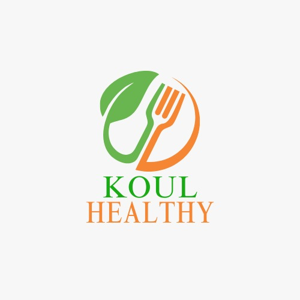

<p align="center"><a href="" target="_blank"></a></p>

<p align="center">
<a href="https://github.com/laravel/framework/actions"></a>
<a href="https://packagist.org/packages/laravel/framework"></a>
</p>

## Install

Clone repo

```
git clone https://github.com/AmineMazza/Koul-Healthy.git
```

composer update/install

```
composer install
```

Générez une nouvelle clé de cryptage

```
php artisan key:generate
```

Copy le fichier .env

```
copy .env.example .env
```

Configurez votre base de données

```
DB_CONNECTION=mysql
DB_HOST=127.0.0.1
DB_PORT=3306
DB_DATABASE=koul-healthy
DB_USERNAME=root
DB_PASSWORD=
```

Exécutez les migrations

```
php artisan migrate
```
Exécuter seeders dans la BD
```
php artisan db:seed --class=UserSeeder
php artisan db:seed --class=ProductSeeder
php artisan db:seed --class=CommandesSeeder
```

Lancer le serveur

```
php artisan serve
```
